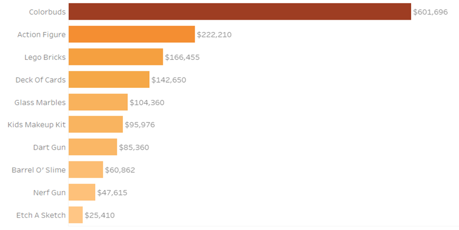

# Toys_Sales_Performance

## Introduction

### Overview

Toys Co. is a fictitious retail chain company in Mexico that wants to analyze its sales data from January 2022 to September 2023 to identify trends, optimize inventory, and improve decision-making.
The project aims to uncover insights such as top-performing products, seasonal trends, store performance, and forecast sales for the next two months to support strategic planning.

### Key Questions/Objectives

Using SMART criteria (Specific, Measurable, Achievable, Relevant, Time-bound) to refine objectives:

  • Analyze sales trends to identify seasonal patterns and optimize promotional strategies.
  
  • Identify the top 10 products by sales revenue and profit to prioritize marketing and inventory efforts.
  
  • Compare location performance by evaluating revenue contributions across regions to improve strategies.
  
  • Examine inventory levels to identify overstocked and high-demand items for better management.
  
  • Review product categories to focus on high-performing segments and improve weaker ones.

### What makes this project stands out

#### Comprehensive Analysis

The project delivers a comprehensive analysis, encompassing overall sales and profit trends, category-specific insights, and regional performance.

#### Actionable Recommendations

It doesn't just present data; it provides specific, prioritized recommendations to improve the business.

#### Interactive and Customizable Dashboard

The dashboard is designed to be highly interactive, allowing users to dynamically analyze the data based on different metrics. Charts can be easily adjusted to display units, sales, or profits through a user-friendly drop-down menu, providing tailored insights based on specific needs, also features a dynamic year filter that automatically updates with new data, ensuring ongoing utility.

### Target Audience

The audience in this project is the sales manager.

Summary of Findings
  
  • Overall Revenue is 15.4 million.
  
  • The number of orders is 99.44 thousand.
  
  • The number of customers is 99.44 thousand.
  
  • There were 91.61 thousand early orders and 7.82 thousand late orders

## Methodology

### Data Origin

The dataset is coming from an open-source dataset on Maven analytics in 4 csv files [see here to find it.](https://app.mavenanalytics.io/datasets?search=Mexico+Toy+Sales)

### Tools

Python, SQL and Tableau

### Data Structure

Four structured tables shown in csv files.

### Data Analysis Strategy

Descriptive analysis.

  • Collect Data

  • Clean and Prepare Data

  • Exploratory Data Analysis (EDA)

  • Generate Insights

  • Report and Visualize

## Dashboard Development

### Key Observations

#### Declining Sales and Profit:

Sales decreased by 6.7% (from $7.5M to $7.0M) and profit decreased by 18.2% (from $2.2M to $1.8M).

#### Category Insights:

  • Toys remained the top sales category, contributing $2.3M in 2023, despite a $0.5M decline.

  • Art & Crafts doubled its sales to $1.8M, rising from the smallest to the second-largest category.

#### Regional Dominance: 

Downtown locations consistently outperformed, contributing 56%  of total sales in 2022 and increasing to 57% of total sales in 2023.

### Key Findings

#### Sales By category

  • Toys: $2.8M → $2.3M (still on top despite a $0.5M drop)

  • Art & Crafts: $0.9M → $1.8M (Sales doubled, now second-largest category)

  

  

#### Profit by Category

  • Electronics: $674.4K → $327K (Significant decline to be third)

  • Art & Crafts: $272.9K → $480.4K (From the second-lowest category to the highest in consumer demand)

  

  

#### Top products by sales

  • 2022: Lego Bricks ($1.33M) → Colorbuds ($1.12M) → Action Figures ($592.2K)

  

  • 2023: Lego Bricks ($1.05M) → Magic Sand ($868.8K) → Colorbuds ($437.0K)

  

#### Top products by profit

  • 2022: Colorbuds ($601.7K) → Action Figures ($222.2K) → Lego Bricks ($166.5K)

  

  • 2023: Colorbuds ($233.2K) → Lego Bricks ($132.2K) → Action Figures ($125.5K)

  

#### Store Location Performance

2022
  • Downtown: $4.2M sales (56%) | $1.2M profit (55%)

  • Airport: $0.7M sales (9%) | $205.0K profit (9%)

2023
  • Downtown: $4.0M sales (57%) | $1.03M profit (57%)

  • Airport: $0.6M sales (9%) | $173.0K profit (10%)

## Recommendations

### High Priority

  • Focus on Growing Categories
      To sustain strong growth, increasing inventory and marketing efforts for Art & Crafts products could add an estimated $0.5M in annual sales, further strengthening their contribution to the business’s success.

  • Electronics
      Review Electronics pricing, introduce new products, and launch targeted campaigns to recover 10% of 2023’s lost profit ($65K), strengthening overall profitability.

  • Inventory
      Optimize inventory by reducing overstock of slow-moving items (e.g., Deck of Cards) and securing sufficient stock for high-demand products (Color Buds, Lego Bricks, Action Figures) to improve cash flow and cut storage costs.

### Medium Priority

  • Expand Downtown Advantage
      Launch loyalty programs and targeted promotions at Downtown stores to leverage their dominance, boosting customer retention could add an estimated $0.3M in annual revenue.

  • Leverage Seasonal Trends
      Leverage historical data to optimize seasonal promotions for especially Toys and Art & Crafts during peak holidays, driving a 5% increase in seasonal sales translating to an additional $0.35M in revenue.

### Low Priority

  • Investigate Underperforming Locations
      Analyze customer feedback and operational challenges at underperforming Airport and Residential stores to halt declines and stabilize performance.

## Deliverables

  • Final Dashboard

  

  • Python & SQL files (Data cleaning- Data Preprocessing - EDA - Insights)

  [GitHub Link](https://github.com/ahmed-fayez-abdalla/Toys_Sales_Performance).

